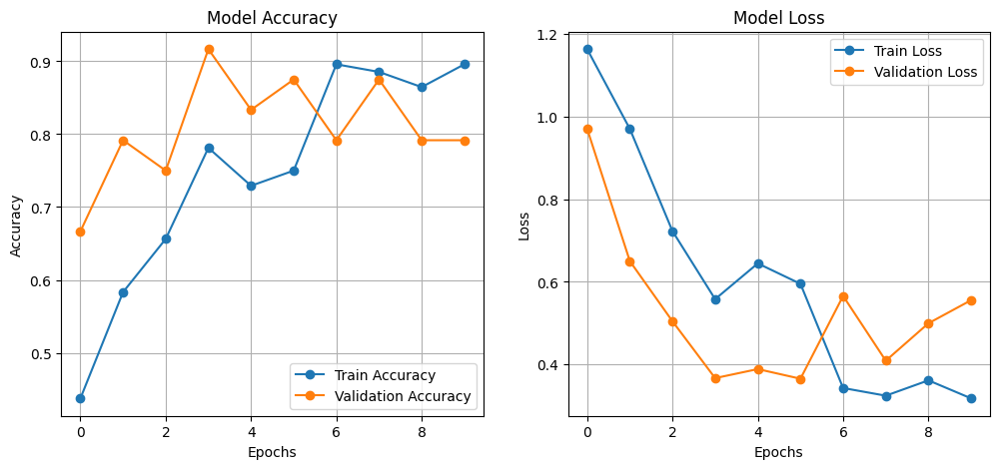
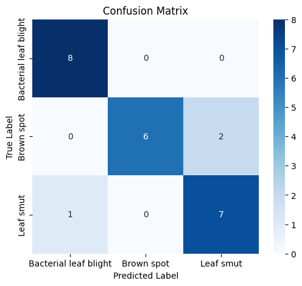
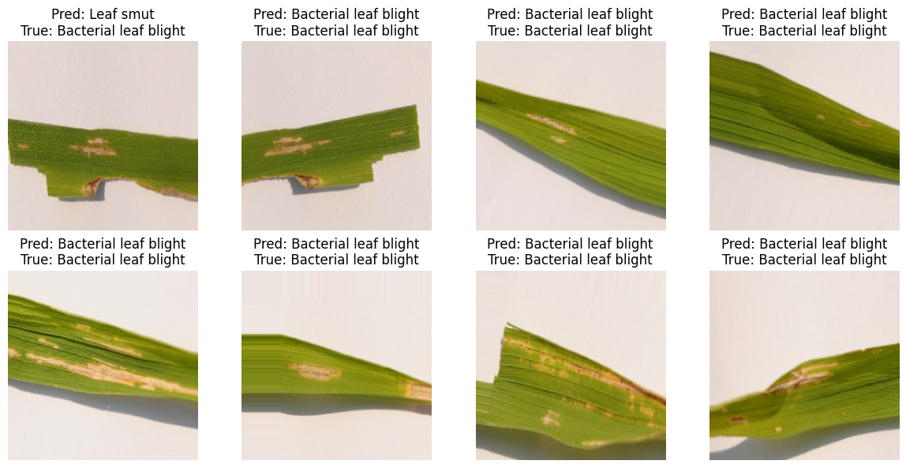

# 🌾 Rice Leaf Disease Classification Using MobileNetV2

This project uses **transfer learning** with MobileNetV2 to classify rice leaf diseases into 3 categories using image data. It includes data augmentation, model training, evaluation, and visualization of results.

## 📁 Dataset
The dataset consists of images stored in three folders (one per class). It was loaded and augmented using `ImageDataGenerator` from TensorFlow.

## 🧠 Model Architecture
- **Base Model**: MobileNetV2 (pre-trained on ImageNet)
- **Layers Added**:
  - GlobalAveragePooling2D
  - Dense(128, relu) + Dropout
  - Dense(64, relu)
  - Dense(3, softmax)

## 📈 Training & Validation Accuracy/Loss

---

## 🔍 Confusion Matrix

---

## 🌿 Sample Predictions

---

## 🛠️ Tech Stack

- TensorFlow / Keras
- Google Colab
- Matplotlib / Seaborn
- MobileNetV2
- Scikit-learn (for metrics)

---

## 📂 Model Save Format

The final trained model is saved in `.keras` format and stored on Google Drive.

---

## 📊 Evaluation

Includes classification report and visualized confusion matrix. Results show good performance on validation data.

---

## 💡 Future Improvements

- Test on more diverse datasets
- Add real-time prediction script
- Deploy via Flask or Streamlit

---

> Developed by **Neelesh Gadi** | [LinkedIn](#) | [Portfolio](#)  
